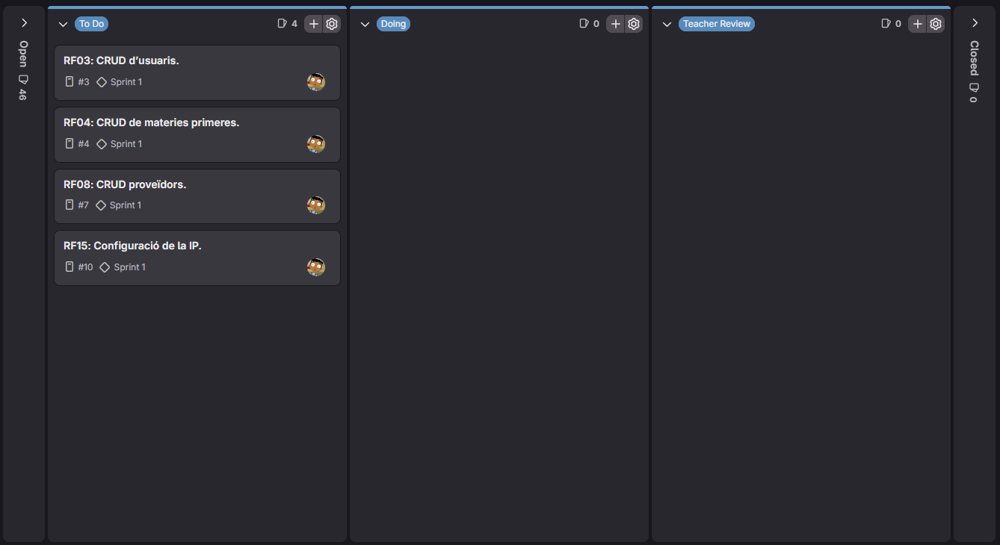
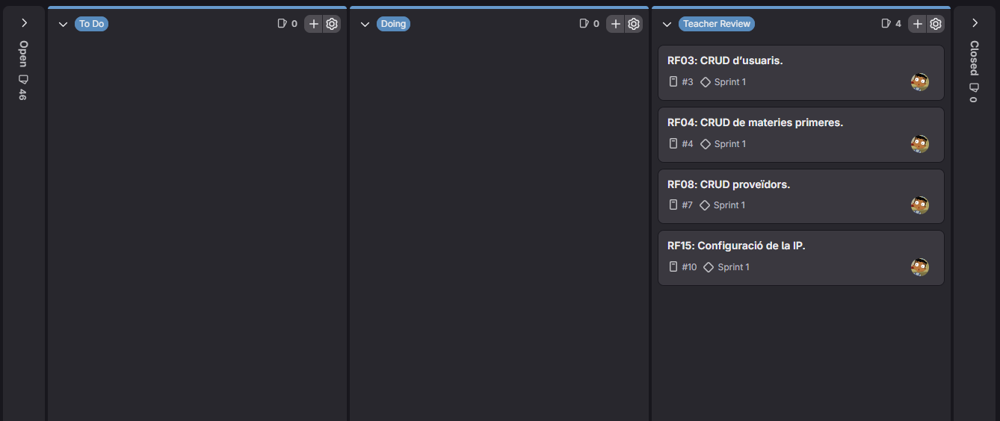
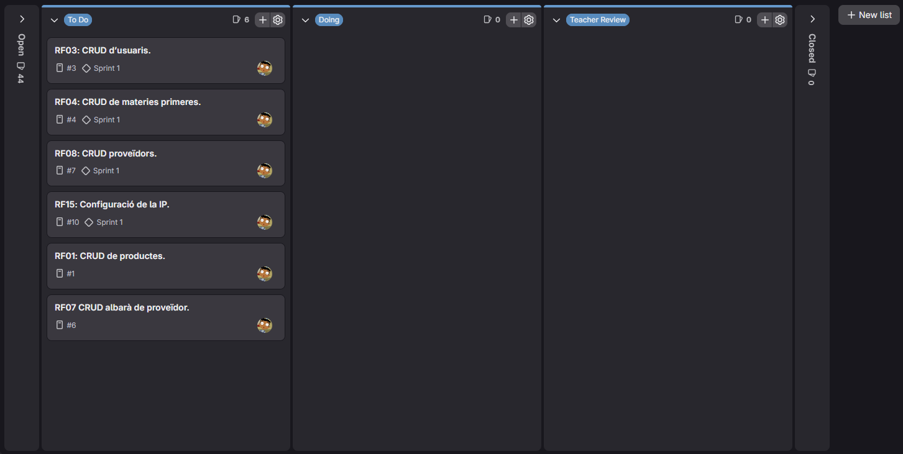
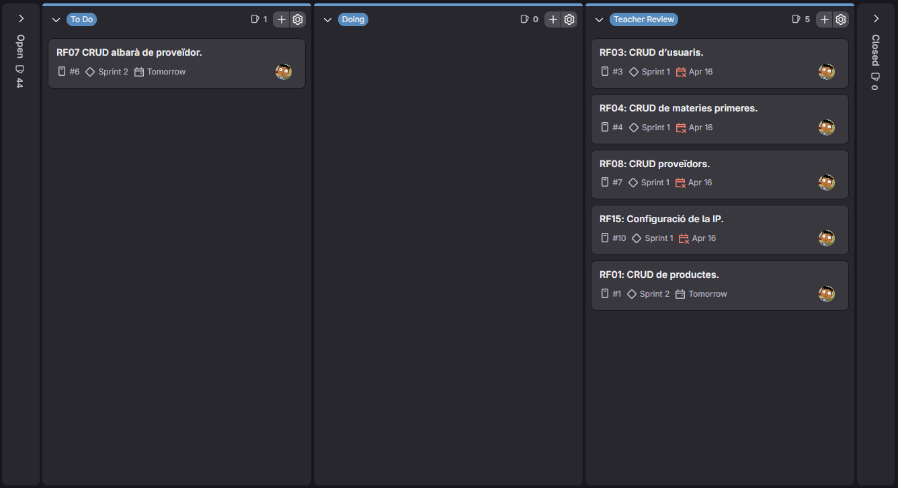
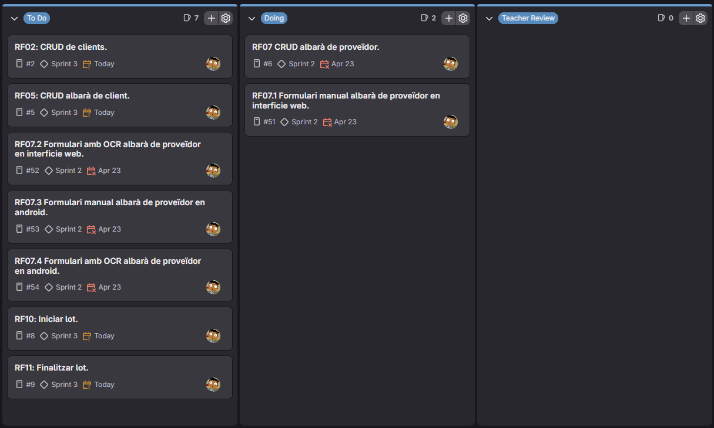
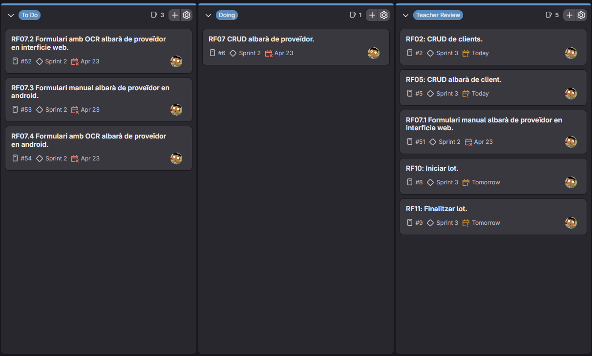
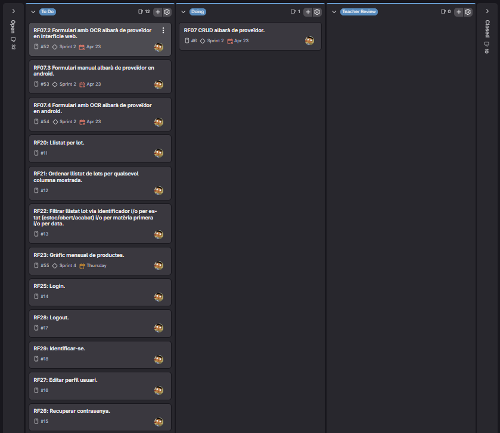
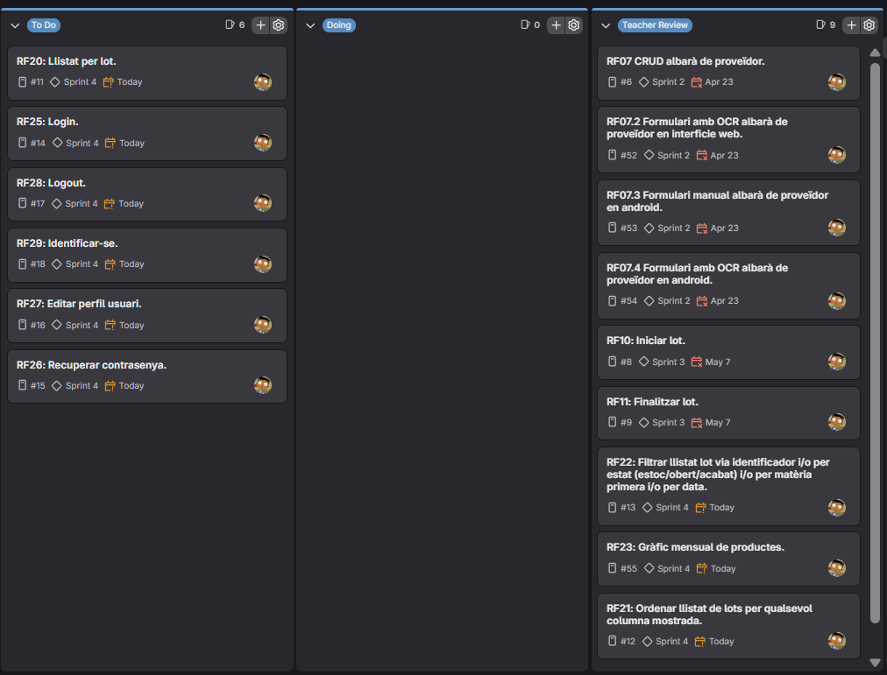
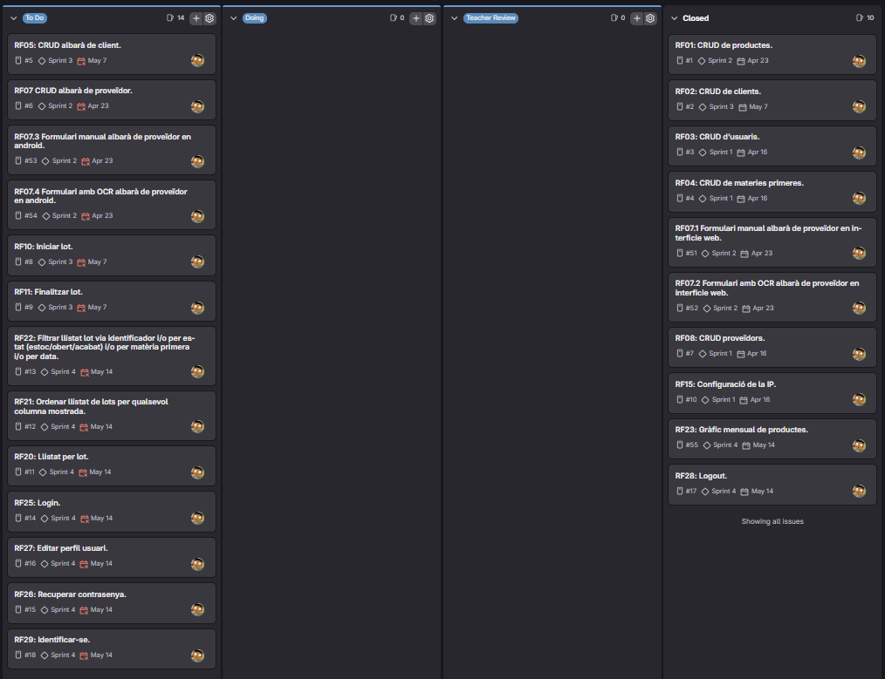
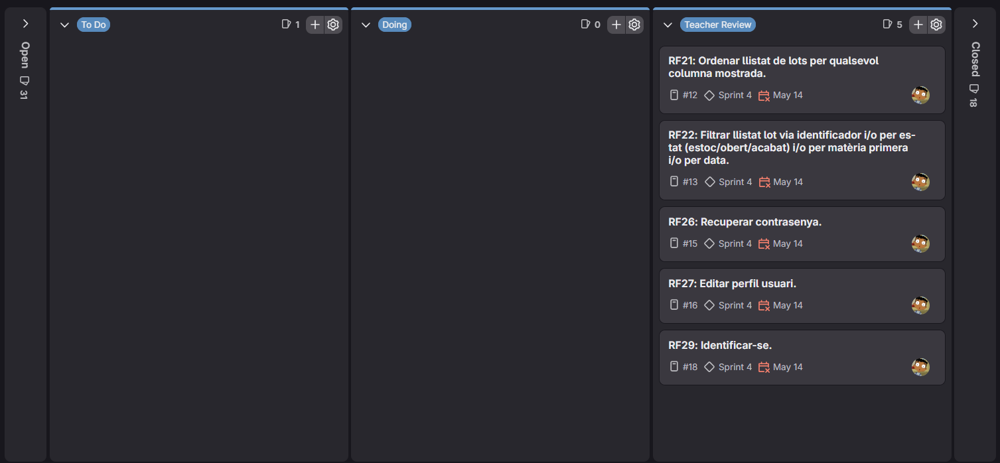

= Documentació de la Memòria
:toc:

== 1. Planificació i Seguiment de Sprints

=== Sprint 1

==== Planificació inicial

===== Board inicial
.Imatge del board inicial

==== Daily Standups

===== Divendres 10 d'Abril
[cols="4*", options="header"]
|=====================================================================
| Què es va fer ahir | Què es farà avui | Quins problemes o preocupacions es tenen | Hores treballades (classe/casa)
|
| Preparar el GitLab, l’estructura de Spring i l’API REST. Començar amb el CRUD d'usuaris, especialment la part del backend.
| He tingut bastantes complicacions amb el GitLab amb alguns commits.
| 6 / 0
|=====================================================================

===== Dilluns 13 d'Abril
[cols="4*", options="header"]
|=====================================================================
| Què es va fer ahir | Què es farà avui | Quins problemes o preocupacions es tenen | Hores treballades (classe/casa)
| Preparar el GitLab, l’estructura de Spring i l’API REST. Començar amb el CRUD d'usuaris, especialment la part del backend.
| Terminar el CRUD d'usuaris, els HTML, i fer el CRUD de matèries primeres i proveïdors completament.
| No he tingut cap problema.
| 6 / 0
|=====================================================================

===== Dimecres 15 d'Abril
[cols="4*", options="header"]
|=====================================================================
| Què es va fer ahir | Què es farà avui | Quins problemes o preocupacions es tenen | Hores treballades (classe/casa)
| Terminar el CRUD d'usuaris, els HTML, i fer el CRUD de matèries primeres i proveïdors completament.
| Falta
| Falta
| Falta
|=====================================================================

===== Dijous 16 d'Abril
[cols="4*", options="header"]
|=====================================================================
| Què es va fer ahir | Què es farà avui | Quins problemes o preocupacions es tenen | Hores treballades (classe/casa)
| Falta
| Configuració del Retrofit2 i realitzar els canvis necessaris a l'entitat usuari (posar-li correu i contrasenya).
| Cap
| 3/1
|=====================================================================

===== Board Final
.Imatge del board final

==== Retrospective Meeting
[cols="3*", options="header"]
|========================================================
| Aspectes positius | Aspectes a millorar | Accions concretes
| He aprofitat bastant bé les hores a classe per a fer la feina d'aquest sprint i he après a fer bastantes coses que en altres projectes no vaig fer jo. també estic intentant utilitzar molt menys la IA comparat amb altres projectes.
| Faltar menys a classe per a enterar-me del que passa i si ha canvis.
| Assistir més a classe.
|========================================================

=== Sprint 2

==== Planificació inicial

===== Board inicial
.Imatge del board inicial

==== Daily Standups

===== Divendres 17 d'Abril
[cols="4*", options="header"]
|=====================================================================
| Què es va fer ahir | Què es farà avui | Quins problemes o preocupacions es tenen | Hores treballades (classe/casa)
| Configuració del Retrofit2 i realitzar els canvis necessaris a l'entitat usuari (posar-li correu i contrasenya).
| Fer la revisió del Sprint 1 i començar a fer les correccions necessaries.
| Cap
| 6/0
|=====================================================================

===== Dilluns 20 d'Abril
[cols="4*", options="header"]
|=====================================================================
| Què es va fer ahir | Què es farà avui | Quins problemes o preocupacions es tenen | Hores treballades (classe/casa)
| Fer la revisió del Sprint 1 i començar a fer les correccions necessaries.
| Seguir fent les correccions relacionades amb els CRUDs de l'anterior Sprint.
| Cap
| 3/0
|=====================================================================

===== Dimecres 22 d'Abril
[cols="4*", options="header"]
|=====================================================================
| Què es va fer ahir | Què es farà avui | Quins problemes o preocupacions es tenen | Hores treballades (classe/casa)
| Seguir fent les correccions relacionades amb els CRUDs de l'anterior Sprint.
| Fer l'última correcció relacionada amb assignar la IP al client Android i fer el CRUD de productes.
| Cap
| 3/0
|=====================================================================

===== Dijous 23 d'Abril
[cols="4*", options="header"]
|=====================================================================
| Què es va fer ahir | Què es farà avui | Quins problemes o preocupacions es tenen | Hores treballades (classe/casa)
| Fer l'última correcció relacionada amb assignar la IP al client Android i fer el CRUD de productes.
| Començar a fer el CRUD dels albarans de proveidors i els lots.
| El RF de CRUD d'albarans de proveidors m'ha donat molts problemes i he tingut falta de temps.
| 4/3
|=====================================================================

===== Board Final
.Imatge del board final

==== Retrospective Meeting
[cols="3*", options="header"]
|========================================================
| Aspectes positius | Aspectes a millorar | Accions concretes
| Estic dependent molt menys de la IA comparat amb els projectes anteriors.
| Ha sigut una setmana complicada i no li he dedicat gaire temps al projecte i es reflexa a la feina que he entregat.
| A partir d'aquest Sprint no conformar-me només amb la feina que faig a classe i també aprofitar el temps lliure que tinc i en comptes de fer altres coses, aprofitar i començar a treballar a casa, perquè després arriba el dijous, estic amb pressa i no entrego tot el que hauria d'entregar.
|========================================================

=== Sprint 3

==== Planificació inicial

===== Board inicial
.Imatge del board inicial

==== Daily Standups

===== Divendres 24 d'Abril
[cols="4*", options="header"]
|=====================================================================
| Què es va fer ahir | Què es farà avui | Quins problemes o preocupacions es tenen | Hores treballades (classe/casa)
| Començar a fer el CRUD dels albarans de proveidors i els lots.
| Fer la revisió del Sprint 2 i començar amb les correccions relacionades amb les validacions d'entrada del formulari web d'albarans de proveïdor.
| Cap.
| 6/0
|=====================================================================

===== Dilluns 27 d'Abril
[cols="4*", options="header"]
|=====================================================================
| Què es va fer ahir | Què es farà avui | Quins problemes o preocupacions es tenen | Hores treballades (classe/casa)
| Fer la revisió del Sprint 2 i començar amb les correccions relacionades amb les validacions d'entrada del formulari web d'albarans de proveïdor.
| Seguir amb les correccions relacionades amb el CRUD dels albarans de proveïdor, en aquest cas amb l'edicio i l'eliminació d'albarans.
| Cap.
| 0/3
|=====================================================================

===== Dimecres 29 d'Abril
[cols="4*", options="header"]
|=====================================================================
| Què es va fer ahir | Què es farà avui | Quins problemes o preocupacions es tenen | Hores treballades (classe/casa)
| Seguir amb les correccions relacionades amb el CRUD dels albarans de proveïdor, en aquest cas amb l'edicio i l'eliminació d'albarans.
| Fer de nou el CRUD d'albarans de proveïdor, per canvis que va haver al diagrama de classes (nova classe LiniaProveidor)
| Cap.
| 0/4
|=====================================================================

===== Dilluns 4 de Maig
[cols="4*", options="header"]
|=====================================================================
| Què es va fer ahir | Què es farà avui | Quins problemes o preocupacions es tenen | Hores treballades (classe/casa)
| Fer de nou el CRUD d'albarans de proveïdor, per canvis que va haver al diagrama de classes (nova classe LiniaProveidor)
| Perfeccionar el CRUD d'albarans de proveïdor i fer els RFs d'iniciar i acabar lots i el CRUD de clients.
| Haver de tornar a fer el CRUD d'albarans m'ha pres més temps del que m'esperava i no crec que em doni temps per a acabar tots els RFs.
| 6/0
|=====================================================================

===== Dimecres 6 de Maig
[cols="4*", options="header"]
|=====================================================================
| Què es va fer ahir | Què es farà avui | Quins problemes o preocupacions es tenen | Hores treballades (classe/casa)
| Perfeccionar el CRUD d'albarans de proveïdor i fer els RFs d'iniciar i acabar lots i el CRUD de clients.
| Començar a fer el CRUD d'albarans de clients. (l'entitat, el repositori i el service)
| Falta de temps.
| 3/0
|=====================================================================

===== Dijous 7 de Maig
[cols="4*", options="header"]
|=====================================================================
| Què es va fer ahir | Què es farà avui | Quins problemes o preocupacions es tenen | Hores treballades (classe/casa)
| Començar a fer el CRUD d'albarans de clients. (l'entitat, el repositori i el service)
| Finalitzar el CRUD d'albarans de client. (fer el controller i el frontend web)
| No m'ha donat temps per a començar a investigar l'OCR.
| 3/1
|=====================================================================

===== Board Final
.Imatge del board final

==== Retrospective Meeting
[cols="3*", options="header"]
|========================================================
| Aspectes positius | Aspectes a millorar | Accions concretes
| Aquests últims dies he aprofitat bastant bé el temps a classe.
| Tot se'm va fer bola i la primera setmana del Sprint no vaig anar a classe i vaig fer molt poca feina per falta de motivació i m'he quedat bastant enrere, sobretot amb el tema OCR, que no ho he començat.
| No faltar a classe aquestes dues setmanes que queden i aprofitar moltíssim el temps tant a classe com a casa per a remontar i recuperar el temps perdut.
|========================================================

=== Sprint 4

==== Planificació inicial

===== Board inicial
.Imatge del board inicial

==== Daily Standups

===== Divendres 8 de Maig
[cols="4*", options="header"]
|=====================================================================
| Què es va fer ahir | Què es farà avui | Quins problemes o preocupacions es tenen | Hores treballades (classe/casa)
| Finalitzar el CRUD d'albarans de client. (fer el controller i el frontend web)
| Fer la revisió del Sprint 3 i començar a implementar l'OCR a la part WEB.
| Vaig molt retardat i tinc molts RFs pendents, d'sprints anteriors i d'aquest.
| 6/0
|=====================================================================

===== Dilluns 11 de Maig
[cols="4*", options="header"]
|=====================================================================
| Què es va fer ahir | Què es farà avui | Quins problemes o preocupacions es tenen | Hores treballades (classe/casa)
| Fer la revisió del Sprint 3 i començar a implementar l'OCR a la part WEB.
| Acabar d'implementar l'OCR a la part WEB i començar a implementar el formulari manual dels albarans de proveïdor a l'android.
| Com hi ha molts tipus d'albarà, amb alguns li costa, però funciona bastant bé amb la majoria.
| 6/2
|=====================================================================

===== Dimarts 12 de Maig
[cols="4*", options="header"]
|=====================================================================
| Què es va fer ahir | Què es farà avui | Quins problemes o preocupacions es tenen | Hores treballades (classe/casa)
| Acabar d'implementar l'OCR a la part WEB i començar a implementar el formulari manual dels albarans de proveïdor a l'android.
| Acabar de perfeccionar el formulari manual d'albarans de proveïdor a l'Android i començar a implementar l'OCR.
| La part d'Android m'ha costat molt més que la WEB.
| 0/3
|=====================================================================

===== Dimecres 13 de Maig
[cols="4*", options="header"]
|=====================================================================
| Què es va fer ahir | Què es farà avui | Quins problemes o preocupacions es tenen | Hores treballades (classe/casa)
| Acabar de perfeccionar el formulari manual d'albarans de proveïdor a l'Android i començar a implementar l'OCR.
| Acabar d'implementar l'OCR a'Android i començar a posar les funcionalitats de començar i finalitzar lots a la part Android.
| Pensava que haviem de fer les funcionalitats d'iniciar i finalitzar lots a la part WEB i només havia de fer-ho a l'Android.
| 3/3
|=====================================================================

===== Dijous 14 de Maig
[cols="4*", options="header"]
|=====================================================================
| Què es va fer ahir | Què es farà avui | Quins problemes o preocupacions es tenen | Hores treballades (classe/casa)
| Acabar d'implementar l'OCR a'Android i començar a posar les funcionalitats de començar i finalitzar lots a la part Android.
| Acabar d'implementar la funcionalitat de començar i finalitzar lots a l'Android, implementar el gràfic mensual de productes venuts i fer la ordenació i els filtres de lots.
| No m'ha donat temps a acabar els RFs d'aquest Sprint.
| 4/4
|=====================================================================

===== Board Final
.Imatge del board final

==== Retrospective Meeting
[cols="3*", options="header"]
|========================================================
| Aspectes positius | Aspectes a millorar | Accions concretes
| Ha sigut una setmana de bastante feina i per sort he pogut concentrar-me i treballar més a casa per a poder recuperar-me una mica, perquè anava molt retardat.
| No tant com abans, però encara vaig retardat i em queda feina pendent que no he pogut acabar aquest Sprint.
| Aquest cap de setmana i la setmana que ve seguiré fent feina a casa també per a poder acabar com més aviat millor i així poder revisar i perfeccionar el projecte.
|========================================================

=== Sprint 5

==== Planificació inicial

===== Board inicial
.Imatge del board inicial

==== Daily Standups

===== Divendres 15 de Maig
[cols="4*", options="header"]
|=====================================================================
| Què es va fer ahir | Què es farà avui | Quins problemes o preocupacions es tenen | Hores treballades (classe/casa)
| Acabar d'implementar la funcionalitat de començar i finalitzar lots a l'Android, implementar el gràfic mensual de productes venuts i fer la ordenació i els filtres de lots.
| Corregir uns errors que vaig veure als RFs fet el dia anterior.
| Cap
| 3/0
|=====================================================================

===== Dilluns 18 de Maig
[cols="4*", options="header"]
|=====================================================================
| Què es va fer ahir | Què es farà avui | Quins problemes o preocupacions es tenen | Hores treballades (classe/casa)
| Corregir uns errors que vaig veure als RFs fet el dia anterior.
| Seguir implementant el Spring Security (Inici i tancament de sessió) i fer la revisió del Sprint 4. A casa modificar els css per a que tota la pàgina tingui coherència.
| Com he implementat el Spring Security i no he comprovat que les funcionalitats funcionessin, tot m'ha petat a la revisió del Sprint 4.
| 6/2
|=====================================================================

===== Dimarts 19 de Maig
[cols="4*", options="header"]
|=====================================================================
| Què es va fer ahir | Què es farà avui | Quins problemes o preocupacions es tenen | Hores treballades (classe/casa)
| Seguir implementant el Spring Security (Inici i tancament de sessió) i fer la revisió del Sprint 4. A casa modificar els css per a que tota la pàgina tingui coherència.
| Començar amb les correccions del Sprint 4. En aquest cas comprovar per què les funcionalitats han petat després d'aplicar Spring Security.
| Cap
| 0/3
|=====================================================================

===== Dimecres 20 de Maig
[cols="4*", options="header"]
|=====================================================================
| Què es va fer ahir | Què es farà avui | Quins problemes o preocupacions es tenen | Hores treballades (classe/casa)
| Començar amb les correccions del Sprint 4. En aquest cas comprovar per què les funcionalitats han petat després d'aplicar Spring Security.
| Terminar d'implementar el login, el logout i algunes funcionalitats relacionades amb la sessió a la interficie web. Implementar funcionalitats d'editar perfil i recuperar contrasenya.
| Cap
| 3/2
|=====================================================================

===== Dijous 21 de Maig
[cols="4*", options="header"]
|=====================================================================
| Què es va fer ahir | Què es farà avui | Quins problemes o preocupacions es tenen | Hores treballades (classe/casa)
| Terminar d'implementar el login, el logout i algunes funcionalitats relacionades amb la sessió a la interficie web. Implementar funcionalitats d'editar perfil i recuperar contrasenya.
| Fer unes correccions relacionades amb els lots i la estética de la web i implementar la funcionalitat d'identificar-se a la interficie Android. (també he implementat que aparegui qui ha registrar els albarans)
| Em queden unes cosetes per pulir i encara he de revisar els requisits no funcionals.
| 4/2
|=====================================================================

===== Board Final
.Imatge del board final

==== Retrospective Meeting
[cols="3*", options="header"]
|========================================================
| Aspectes positius | Aspectes a millorar | Accions concretes
| He aprofitat bastant el temps i he adelantat bastante feina comparat amb altres setmanes. Ja no em queden requisits funcionals per fer.
| Ni m'he mirat encara els requisits no funcionals i se que tenen molt de pes i s'han de tenir molt en compte.
| Aprofitar completament aquests dies que queden per a terminar de revisar i pulir totes les mancances que tingui el meu projecte.
|========================================================

== 2. Documentació Tècnica

=== Justificació de decisions de disseny o implementació no especificades als requeriments
Durant el desenvolupament d'EasyTraza he pres algunes decisions tant a nivell estètic com tècnic per millorar l'experiència d'usuari i la fluïdesa del sistema:

* *Estètica i usabilitat web i Android:* He utilitzat una paleta de colors basada en tons marrons per a totes les pantalles tant en web com en Android, mantenint una estètica coherent a tota l'app. La decisió de posar tot en tons marrons va ser del client per la relació que té l'app amb la seva fleca.
* *Filtratge i ordenació:* He implementat ordenacions i filtratges per tots els camps visibles a les llistes de totes les entitats.

=== Llista final de requeriments implementats

==== Requisits funcionals
* *RF01:* CRUD de productes.
* *RF02:* CRUD de clients.
* *RF03:* CRUD d’usuaris.
* *RF04:* CRUD de matèries primeres.
* *RF05:* CRUD albarà de client amb línies de producció.
* *RF07:* CRUD albarà de proveïdor amb línies de lots amb matèries primeres.
* *RF08:* CRUD proveïdors.
* *RF10:* Iniciar lot.
* *RF11:* Finalitzar lot.
* *RF15:* Configuració de la IP: Al client Android, la configuració de la IP del servidor ha de ser persistent localment i configurable per qualsevol usuari.
* *RF20:* Llistat per lot: Aquest llistat permet saber la producció generada amb un lot determinat. Cada línia del llistat ha d’incloure: Producte fabricat, quantitat fabricada, client, número d’albarà, data d’albarà.
* *RF21:* Ordenar llistat de lots per qualsevol columna mostrada.
* *RF22:* Filtrar llistat lot via identificador i/o per estat (estoc/obert/acabat) i/o per matèria primera i/o per data.
* *RF23:* Gràfic mensual de productes: El sistema ha de permetre visualitzar l’evolució diària de la quantitat de productes venuts durant un mes concret mitjançant un gràfic.
* *RF25:* Login. El sistema ha de permetre que un usuari activat pugui iniciar sessió a l’aplicació amb el seu correu electrònic i contrasenya.
* *RF26:* Recuperar contrasenya. El sistema ha de permetre que l’usuari pugui recuperar la contrasenya en cas d’oblit.
* *RF27:* Editar perfil usuari. El sistema ha de permetre que l’usuari pugui modificar totes les dades del seu perfil.
* *RF28:* Logout. El sistema ha de permetre que l’usuari pugui tancar la sessió.
* *RF29:* Identificar-se. El sistema ha de permetre que un usuari activat pugui iniciar sessió a l’aplicació sense contrasenya.

==== Requeriments no funcionals

*Arquitectura i Tecnologies Globals*
* *RN01:* Arquitectura client-servidor basada en una API REST (Spring Boot) amb dos client: front-end mòbil (Kotlin+Jetpack Compose) i front-end web (HTML+CSS+Thymeleaf).
* *RN02:* Comunicació entre Mobile i Backend basada en principis REST (arquitectura desacoblada).
* *RN03:* El backend ha de poder executar-se a Windows.
* *RN04:* Backend implementat amb Spring Boot (Maven) i estructurat en capes: servei API REST, lògica de negoci i persistència.

*Estàndards de Codi i Qualitat*
* *RN05:* Codi optimitzat, eficient, sense redundàncies i seguint les bones pràctiques de cada tecnologia.
* *RN06:* Ús òptim de classes, interfícies, mètodes i paquets.
* *RN07:* Documentació del codi amb JavaDoc (Backend) i KDoc (Kotlin) en tots els mètodes i classes.

*Gestió d'Errors i Registre (Logs)*
* *RN08:* Backend: Sistema de logs en fitxers per registrar errors, excepcions i avisos per a l'administrador/manteniment.
* *RN09:* Gestió d'excepcions informant l'usuari de manera comprensible i en el seu idioma.

*Gestió del Projecte i Desenvolupament*
* *RNF10:* El projecte s’ha de gestionar amb Git i GitLab seguint una estructura de branques similar a un entorn professional. S’hauran d’utilitzar, com a mínim, les branques main, develop i branques feature per a cada funcionalitat rellevant. La branca main contindrà versions estables i develop serà la branca principal d’integració durant els sprints.
* *RN11:* Les funcionalitats desenvolupades en branques feature/* s’hauran d’integrar a develop de forma controlada i traçable. En projectes d’un únic integrant, els Merge Request no seran obligatoris, però caldrà mantenir commits descriptius i validar la funcionalitat abans del merge. Un cop fusionada, la branca feature/* s’haurà d’eliminar per mantenir el repositori net i ordenat.
* *RN12:* Cada commit ha de correspondre a una única funcionalitat i incloure una descripció clara, concisa i autoexplicativa. Els commits derivats de issues han de referenciar l’issue associat.
* *RN13:* El repositori de GitLab ha de contenir tres carpetes principals: backend (projecte del servidor), mobile (projecte del client Android) i documentació.
* *RN14:* El repositori de GitLab ha d’incloure un fitxer README amb el vídeo del projecte enllaçat i una breu descripció del projecte amb captures de la UI.

*Arquitectura i desenvolupament frontend Mobile*
* *RN20:* L’app s’ha de desenvolupar utilitzant l’IDE Android Studio, utilitzant Jetpack Compose i el llenguatge Kotlin per implementar la interfície gràfica de l’app per crear una aplicació nativa compatible amb dispositius Android.
* *RN21:* L’app ha de seguir l’arquitectura Feature Layer juntament amb “Clean Architecture” (UI layer - Domain layer - Data layer).
* *RN22:* En la capa IU ha de seguir l'arquitectura moderna MVVM (Model-View-ViewModel) gestionant l’estat amb MutableStateFlow i MutableStateOf quan sigui necessari.
* *RN23:* L’app s’ha de poder executar en qualsevol emulador i dispositiu mòbil amb sistema operatiu Android.

*Interfície d’usuari i UX frontend*
* *RN25:* La interfície d'usuari (UI) ha de ser atractiva, amb coherència en colors, tipografies, icones i una distribució eficient dels elements. Totes les pantalles han de seguir el mateix estil per garantir una experiència homogènia.
* *RN26:* Usabilitat (UX) i accessibilitat: La interfície d’usuari ha de ser intuïtiva, eficient i fàcil d’usar. No hi pot haver passos innecessaris per accedir a les funcionalitats i s'ha de deixar molt clar què es pot fer en cada moment. A més, el disseny ha de mantenir coherència entre les funcionalitats disponibles i les restringides. Els elements interactius han de tenir etiquetes descriptives per facilitar-ne l'ús.
* *RN27:* Fluïdesa garantida: La UI ha de respondre a les entrades de l'usuari en tot moment, evitant bloquejos o congelacions durant operacions intensives. S’han d’utilitzar mecanismes com a operacions asíncrones quan sigui necessari.
* *RN28:* Responsive: En cas de poder variar la grandària de la pantalla, s’ha d’adaptar el seu contingut de forma proporcionada.
* *RN29:* Internacionalització: La interfície d'usuari ha d'estar disponible en català i castellà.

*Seguretat web*
* *RN61:* L’accés als front-ends ha de disposar d’un sistema d’autenticació mitjançant usuari i contrasenya, assegurant intents d'accés no autoritzats.
* *RN62:* El backend no ha de permetre l'accés mitjançant URL que no estiguin autoritzades.
* *RN63:* L’emmagatzemament de la contrasenya d’usuari ha de ser un procés segur en tot moment utilitzant tècniques de hash robustes.
* *RN64:* L’aplicació ha de protegir en tot moment les dades personals dels usuaris davant accessos no autoritzats. Aquestes mai poden quedar exposades a altres usuaris de l’aplicació.
* *RN65:* Les sessions d’usuari no poden romandre obertes per temps indefinit i han de caducar-se de forma segura.
* *RN66:* Les dades entre el client web i el servidor han d’estar xifrades via HTTPS usant certificat TLS. El certificat pot ser autosignat.

*Seguretat mobile*
* *RN67:* L’accés als front-ends ha de disposar d’un sistema d’identificació mitjançant nom d’usuari.

=== Desviacions respecte a la planificació inicial
La desviació principal del projecte va ser la implementació de l'OCR. Ho vaig anar retardant tant per complexitat com per manca de motivació i se'm va acumular la feina, sobretot amb els dubtes que teníem relacionats amb els albarans de proveïdor i els canvis que va caldre fer després de l'aparició tant de les línies de proveïdor com les de client.

=== Incidències trobades durant el desenvolupament
* Vaig tenir moltes dificultats configurant la part d'Android. Aconseguir fer funcionar les trucades amb Retrofit2 em va portar molts més temps i em va costar més que el desenvolupament del backend web.
* El funcionament de l'OCR no és perfecte. Com hi ha molts tipus d'albará de proveïdor, no he pogut perfeccionar l'OCR per a poder fer-ho funcionar perfectament amb tots.
* No he aconseguit fer que les sessions del client Android caduquin per inactivitat. A la part web em funciona bé, però el client Android ho ignora completament.

== 3. Propostes de Millora

=== Millores futures o funcionalitats no implementades
* *RF30: CRUD Comanda:* Com era opcional, aquest és l'únic requisit funcional que no he implementat. El motiu és que al projecte ja tinc un CRUD d'albarans de clients que té els estats 'Lliurat' i 'No lliurat'. Considero que aquesta funcionalitat ja cobreix perfectament la funció de les comandes: un usuari pot crear un albarà quan rep una comanda i mantenir-lo 'No lliurat' fins que s'entregui al client. En el moment de l'entrega, simplement pot canviar l'estat a 'Lliurat', i en cas que el que s'entregui sigui diferent del que el client demanava al principi, els albarans que tenen l'estat 'No lliurat' es poden editar. També es podria implementar el CRUD de comandes, però considero que així queda més resumit i l'ús és més simple.
* *Perfeccionament de l'OCR:* Entrenar millor la IA que reconeix els camps dels albarans o crear plantilles per als proveïdors per reduir el marge d'error en albarans amb dissenys diferents.

== 4. Conclusió

=== Valoració final del projecte i aprenentatges obtinguts
Per una banda, amb aquest projecte he après a construir una aplicació des de zero, ja que als projectes anteriors sempre em trobava aquesta base ja feta. També m'alegro d'haver depès molt menys de la IA i picar més codi a mà, intentant resoldre els problemes per mi mateix consultant projectes anteriors o apunts. D'altra banda, el nivell d'exigència d'aquest projecte m'ha servit per adonar-me que, tot i haver aconseguit acabar el projecte, no vull fer això per la resta de la meva vida.